# 🔐 SOC Alert Monitoring - Brute Force Detection using Splunk

## 📌 Overview
This project demonstrates a real-world SOC (Security Operations Center) use case for detecting brute force attacks on a web application using Splunk SIEM.

The lab simulates attacker behavior using Burp Suite and analyzes authentication logs to identify malicious login attempts through log correlation and alerting.

---

## 🏗️ Architecture (High-Level Design)

This architecture represents the end-to-end flow of brute force attack detection, from web application interaction to SIEM-based alerting and SOC response.

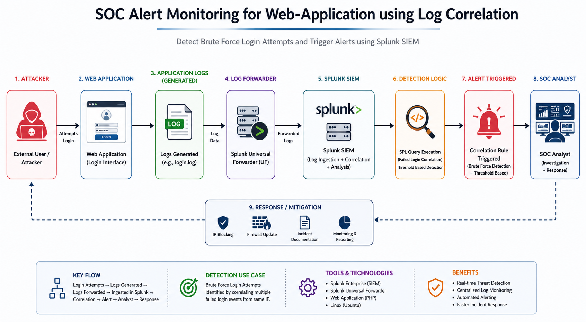

---

## 🛠️ Tools & Technologies
- Splunk Enterprise (SIEM)
- Splunk Universal Forwarder (Log Collection)
- Ubuntu Server (Web Application Hosting)
- Burp Suite (Attack Simulation)
- Apache Web Server Logs

---

## 🌐 Web Application (Attack Surface)

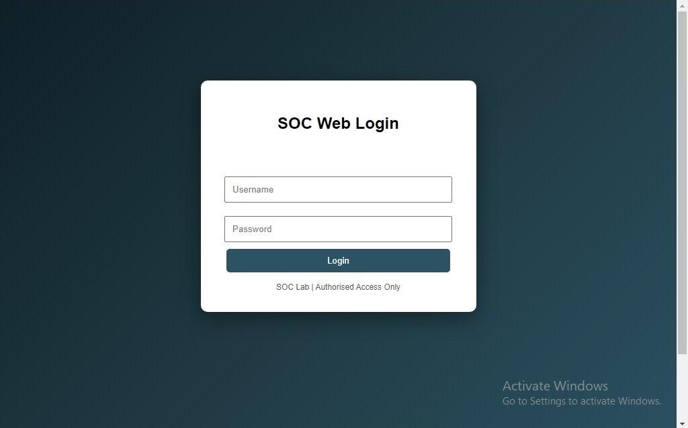

---

## 🧪 Attack Simulation (Burp Suite)

### 🔹 Intercepting Login Request
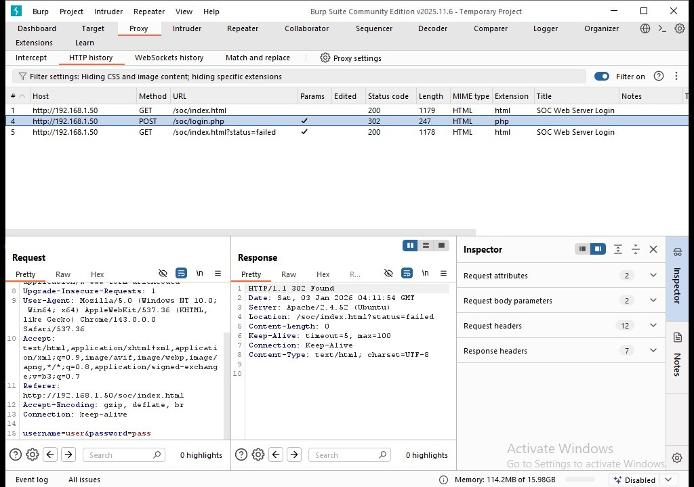

### 🔹 Payload Configuration
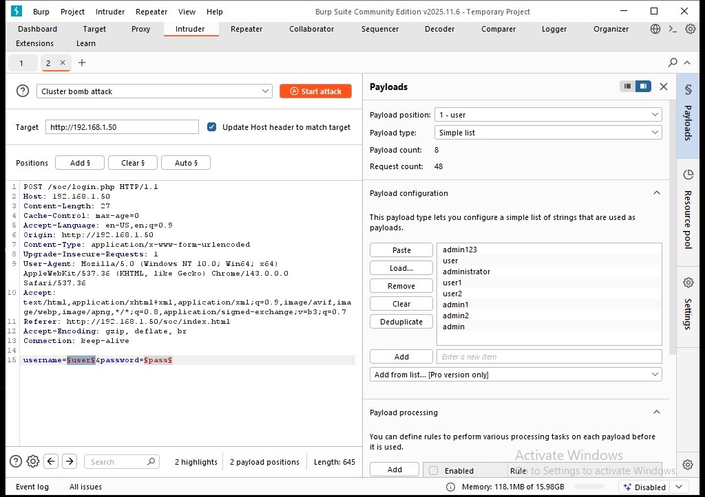

### 🔹 Brute Force Attack Execution
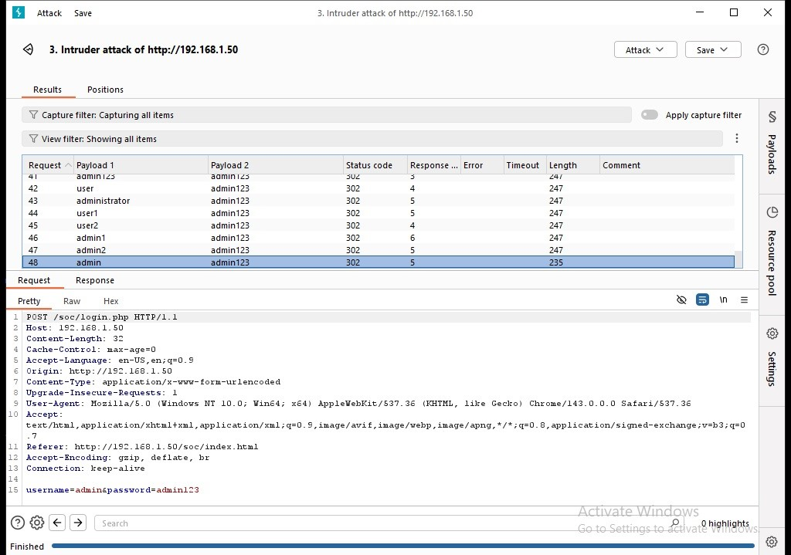

---

## 📥 Log Generation (Web Server)

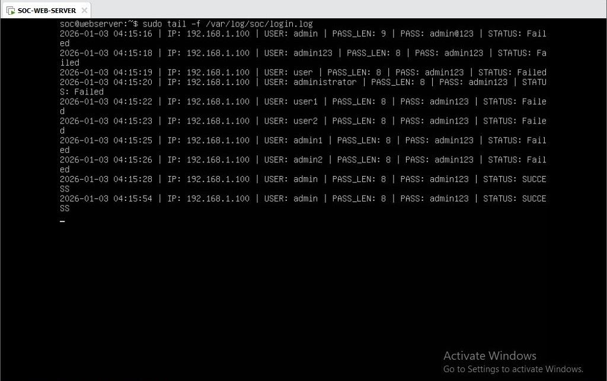

---

## 📊 Logs in Splunk

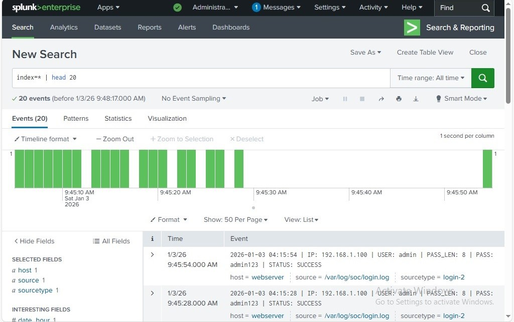

### 🔹 Failed Login Attempts
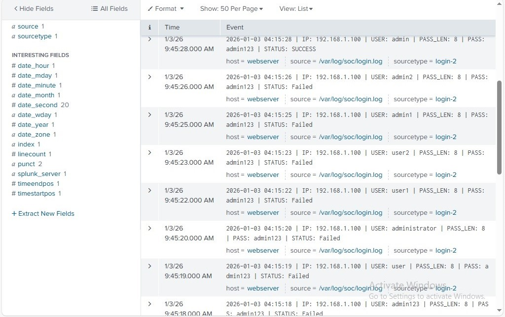

---

## 🔍 Detection Logic (SPL Query)

The detection rule identifies repeated failed login attempts from the same source IP. This helps distinguish brute force attacks from normal user login failures.

```spl
index=main "STATUS: Failed"
| rex "IP:\s(?<src_ip>\d+\.\d+\.\d+\.\d+)"
| stats count as failed_attempts by src_ip
| where failed_attempts > 3
```

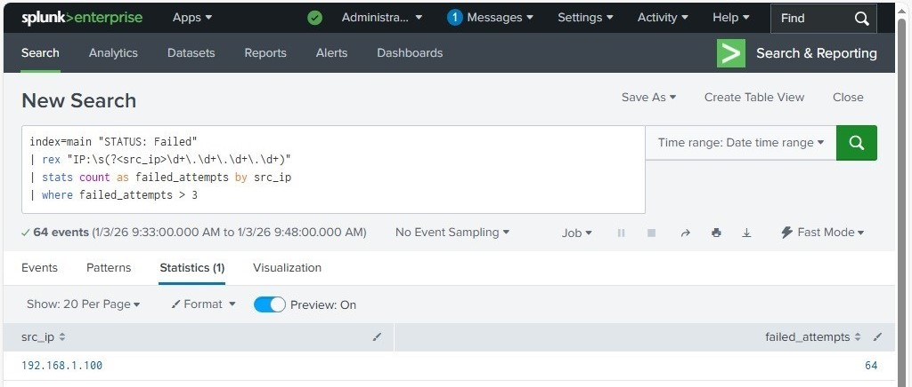

---

## 🚨 Alert Triggered

- Alert Name: **Failed Login Attempts**
- Trigger Condition: More than 3 failed login attempts from a single IP within a defined time window
- Severity: High

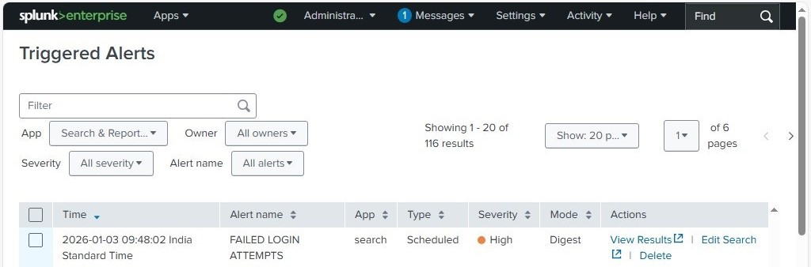

---

## 🛡️ Incident Response (IP Blocking)

- Malicious IP identified from alert  
- Action: Source IP was temporarily blocked to prevent further unauthorized attempts  

```bash
sudo iptables -I INPUT -s 192.168.1.100 -j DROP
```

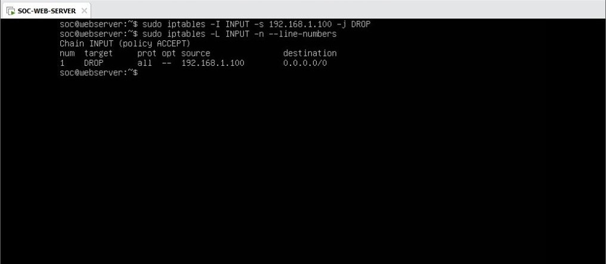

---

## 🧑‍💻 SOC Investigation Workflow

1. Validate alert authenticity  
2. Identify source IP and targeted user  
3. Analyze failed login count  
4. Check historical login activity  
5. Confirm brute force pattern  
6. Initiate response (IP block)  

---

## 🎯 Use Case Summary

This project simulates a real-world SOC scenario where an attacker performs a brute force attack on a web application. Logs are collected, ingested into Splunk, correlated using SPL queries, and alerts are generated for SOC analysts to investigate and respond.

It demonstrates end-to-end threat detection, analysis, and response workflow.

---

## 📈 Key Learnings

- SIEM log correlation techniques  
- Splunk SPL query writing  
- Brute force detection strategies  
- Alert tuning & false positive reduction  
- SOC investigation workflow  
- Incident response handling  

---

## 🔮 Future Improvements

- SOAR automation for response  
- Geo-IP enrichment  
- Threat intelligence integration  
- Advanced anomaly detection  

---

## 👤 Author
Chandan G  
Aspiring SOC Analyst | SIEM | Blue Team
