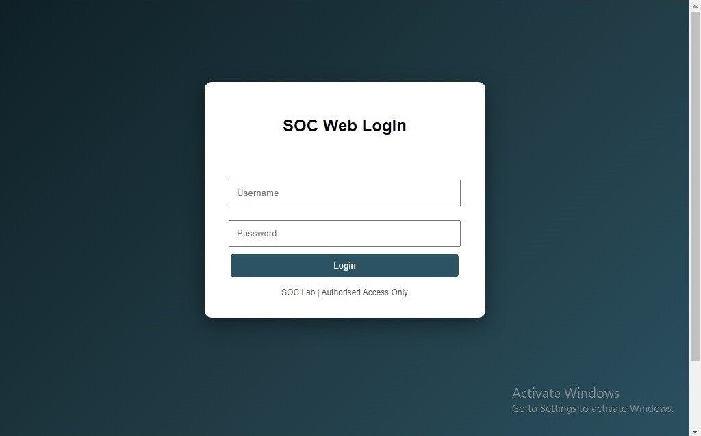
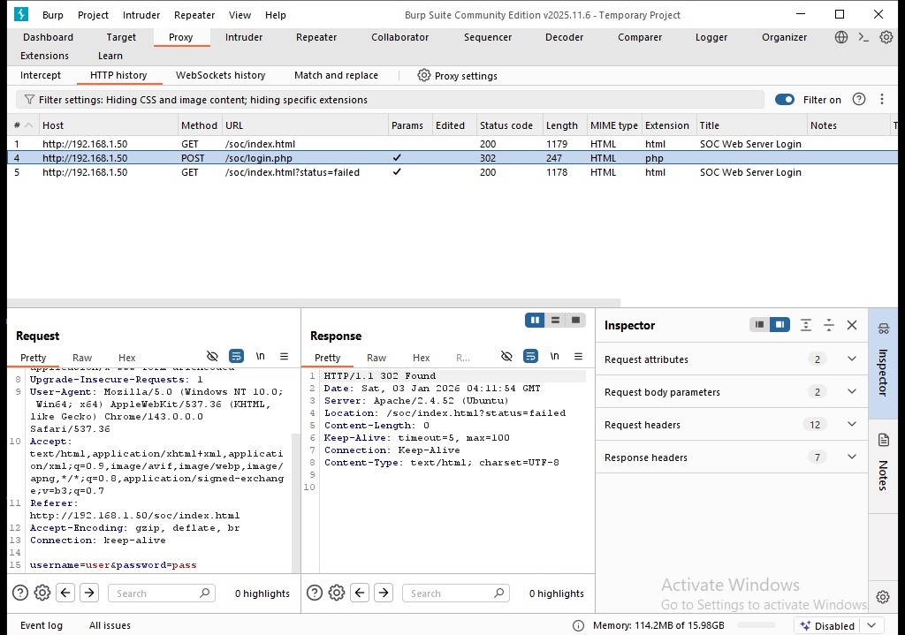
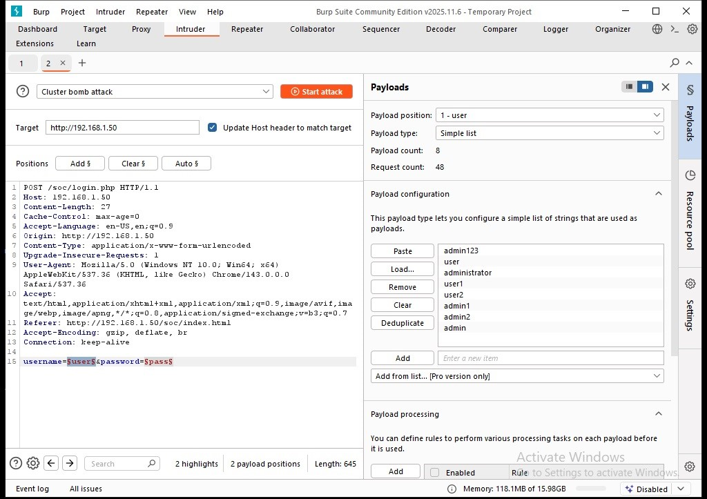
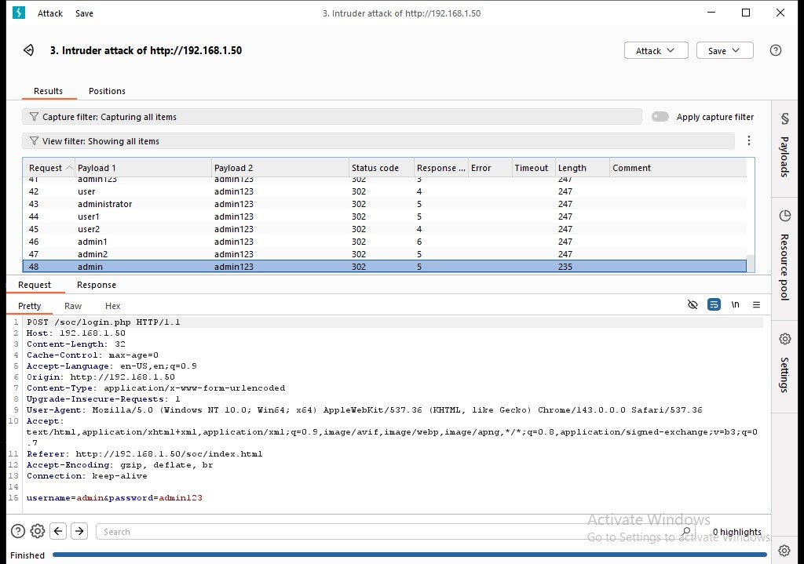
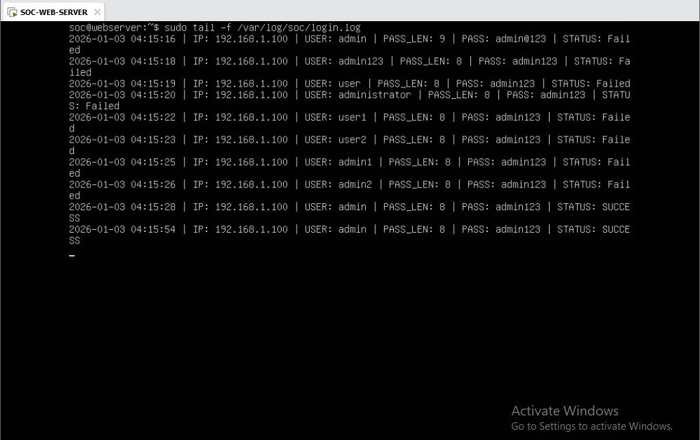
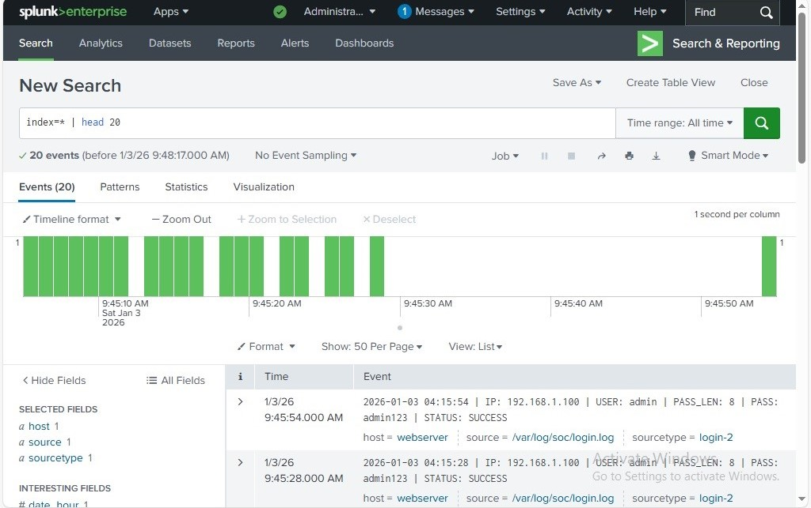
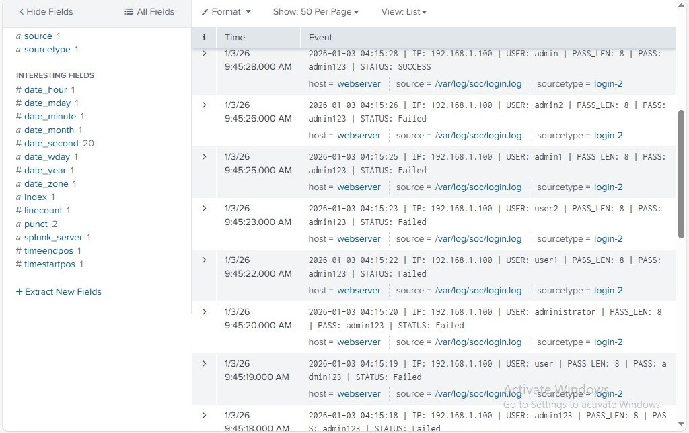
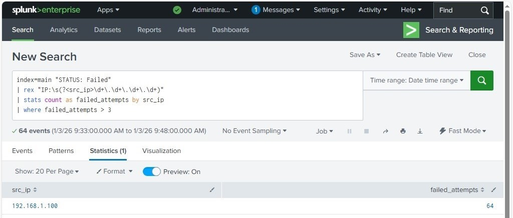
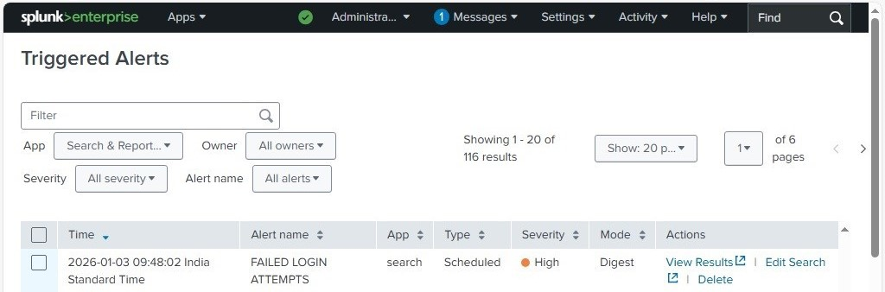
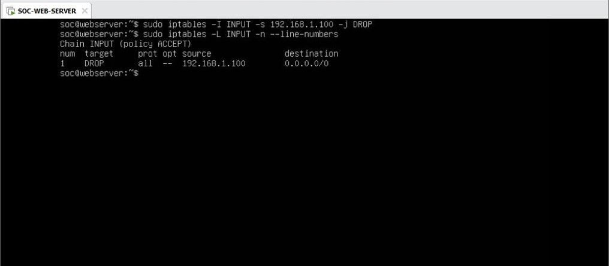

# SOC Home Lab - Brute Force Detection using Splunk

## Overview

This project demonstrates a real-world SOC use case for detecting brute force attacks on a web application using Splunk SIEM. The lab simulates attacker behavior using Burp Suite and analyzes authentication logs to identify malicious login attempts through SPL-based log correlation and automated alerting.

---

## Lab Architecture

```
Ubuntu Web Server (Attack Target)
        |
        | Apache Web Server Logs
        ▼
Splunk Universal Forwarder
        |
        | Log forwarding to SIEM
        ▼
Splunk Enterprise (SIEM)
        |
        ├── SPL Correlation Rule (Brute Force Detection)
        ├── Alert Triggering
        └── Incident Response (iptables IP Block)
```

**Resources used:**
- Ubuntu Server — web application hosting and log generation
- Apache Web Server — generates authentication logs
- Splunk Universal Forwarder — ships logs to Splunk
- Splunk Enterprise — SIEM for detection and alerting
- Burp Suite — attack simulation tool

---

## Technologies Used

- Splunk Enterprise (SIEM)
- Splunk Universal Forwarder
- SPL (Search Processing Language)
- Ubuntu Server
- Apache Web Server
- Burp Suite
- iptables
- MITRE ATT&CK Framework

---

## Web Application (Attack Surface)



---

## Attack Simulation (Burp Suite)

### Intercepting Login Request


### Payload Configuration


### Brute Force Attack Execution


---

## Log Generation (Web Server)



---

## Logs in Splunk



### Failed Login Attempts


---

## Detection Logic (SPL Query)

The detection rule identifies repeated failed login attempts from the same source IP. Thresholds can be tuned based on normal user behavior and time-based correlation to reduce false positives.

SPL Rule: [brute-force-detection.spl](./SPL-Rules/brute-force-detection.spl)

```spl
index=main "STATUS: Failed"
| rex "IP:\s(?<src_ip>\d+\.\d+\.\d+\.\d+)"
| stats count as failed_attempts by src_ip
| where failed_attempts > 3
```



---

## Alert Triggered

- Alert Name: Failed Login Attempts
- Trigger Condition: More than 3 failed login attempts from a single IP within a defined time window
- Severity: High
- MITRE Technique: T1110 - Brute Force



---

## Incident Response (IP Blocking)

Malicious IP identified from alert. Source IP blocked using iptables to prevent further unauthorized access attempts. Further actions in a real SOC would include user notification, account lockout, and escalation if lateral movement is suspected.

```bash
sudo iptables -I INPUT -s 192.168.1.100 -j DROP
```



---

## Incident Investigation Walkthrough

### Scenario: Brute Force Alert Triggered

**Step 1 — Alert fired**
Splunk generated a high-severity alert after detecting more than 3 failed login attempts from the same source IP within the configured time window.

**Step 2 — Investigated in Splunk**
Opened the triggered alert. Ran the SPL query to confirm the source IP, the number of failed attempts, and the targeted user account.

**Step 3 — Confirmed brute force pattern**
The query returned a single source IP with 50+ failed attempts in a short window — consistent with automated brute force behaviour from Burp Suite Intruder.

**Step 4 — Triage decision**
Incident classified as True Positive. Blocked the source IP using iptables immediately.

**Step 5 — Incident closed**
Documented the finding with source IP, attempt count, timestamp, and response action taken.

---

## SOC Investigation Workflow

1. Validate alert authenticity
2. Identify source IP and targeted user account
3. Analyze failed login count and time pattern
4. Check historical login activity from that IP
5. Confirm brute force pattern
6. Initiate response — IP block via iptables

---

## Key Skills Demonstrated

- SIEM Configuration and Log Ingestion
- SPL Query Development
- Brute Force Detection and Analysis
- Alert Tuning and False Positive Reduction
- Incident Response and Containment
- SOC Investigation Workflow
- Log Correlation Techniques

---

## What I Learned

- How to build an end-to-end SIEM pipeline from log source to alert
- Writing SPL correlation rules for real-world attack patterns
- How to simulate attacks and validate detection coverage
- Incident response decision-making from alert to containment
- The importance of threshold tuning to minimize false positives

---

## Future Improvements

- SOAR automation for response playbooks
- Geo-IP enrichment for source IP context
- Threat intelligence feed integration
- Advanced anomaly detection with machine learning

---

## Author

Chandan G

LinkedIn: https://linkedin.com/in/chandan-g-7749573a6

GitHub: https://github.com/Chandan-G-04
